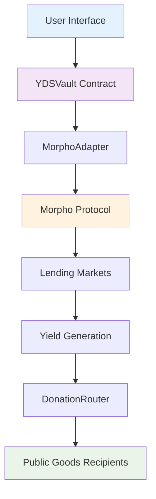

# 🌿 Octant V2 Tutorial - Yield Donating Strategy Vault

<div align="center">


<div align="center">

**Octant V2: Yield-Driven Staking Tutorial**

[](https://opensource.org/licenses/MIT)
[](https://getfoundry.sh/)
[](https://reactjs.org/)
[](https://morpho.org/)

[Documentation](#documentation) • [Quick Start](#quick-start) • [Architecture](#architecture) • [Testing](#testing) • [Contributing](#contributing)

</div>

---

## Overview

Octant V2 is a yield-driven staking protocol that enables sustainable funding for public goods through DeFi yield generation. Users deposit USDC to earn yield via Morpho lending markets, with 100% of generated yield automatically donated to public goods while preserving user principal.

### Key Value Propositions

- **Sustainable Public Goods Funding**: Continuous yield generation creates ongoing funding streams
- **Zero-Cost Participation**: Users retain full access to their principal deposits
- **Real DeFi Integration**: Leverages battle-tested Morpho protocol for yield generation
- **Transparent Operations**: All transactions and donations tracked on-chain
- **Competitive Returns**: ~7% APY from institutional-grade lending markets

### Core Features

- **Morpho Protocol Integration**: Direct integration with Morpho's lending infrastructure
- **Principal Protection**: ERC4626-compliant vault with guaranteed withdrawals
- **Modern Web Interface**: React-based frontend with Web3 connectivity
- **Comprehensive Testing**: Full test coverage with mainnet fork validation
- **Real-time Analytics**: Live tracking of deposits, yields, and donations

### System Architecture

The protocol follows a modular architecture designed for security, efficiency, and maintainability:



### Component Overview

| Component | Technology | Purpose |
|-----------|------------|---------|
| **YDSVault** | Solidity (ERC4626) | Core vault managing deposits and yield tracking |
| **MorphoAdapter** | Solidity | Interface layer for Morpho protocol integration |
| **DonationRouter** | Solidity | Automated yield distribution to recipients |
| **Frontend** | React + Vite + Wagmi | User interface for vault interactions |
| **Testing Suite** | Foundry | Comprehensive testing with mainnet fork |

## Repository Structure

```
octant-yds-tutorial/
├── contracts/                 # Smart contract implementation
│   ├── src/contracts/
│   │   ├── YDSVault.sol      # Main vault contract (ERC4626)
│   │   ├── DonationRouter.sol # Yield distribution logic
│   │   └── adapters/
│   │       └── MorphoAdapter.sol # Morpho protocol integration
│   ├── test/                 # Test suite with mainnet fork
│   ├── script/               # Deployment and utility scripts
│   └── lib/                  # External dependencies
└── frontend/                 # Web application
    ├── src/
    │   ├── components/       # React UI components
    │   ├── hooks/           # Web3 integration hooks
    │   └── lib/             # Configuration and utilities
    └── public/              # Static assets
```

## Quick Start

### Prerequisites

- **Node.js** (v18 or higher)
- **Foundry** ([Installation guide](https://getfoundry.sh/))
- **Git**
- **MetaMask** or compatible Web3 wallet

### Installation

1. **Clone the repository**
   ```bash
   git clone https://github.com/yourusername/octant-yds-tutorial.git
   cd octant-yds-tutorial
   ```

2. **Install dependencies**
   ```bash
   # Smart contracts
   cd contracts && forge install
   
   # Frontend application
   cd ../frontend && npm install
   ```

3. **Configure environment**
   ```bash
   cd contracts
   cp .env.example .env
   # Edit .env with your RPC URL and private key
   ```

### Running the Application

1. **Start mainnet fork**
   ```bash
   cd contracts
   source .env
   anvil --fork-url $MAINNET_RPC_URL --fork-block-number 21150000
   ```

2. **Deploy contracts** (in new terminal)
   ```bash
   cd contracts
   source .env
   forge script script/DeployMorphoFork.s.sol --rpc-url http://127.0.0.1:8545 --private-key $PRIVATE_KEY --broadcast
   ```

3. **Launch frontend** (in new terminal)
   ```bash
   cd frontend
   npm run dev
   # Open http://localhost:5173
   ```

## Testing

### Comprehensive Test Suite

Run the main demonstration test to verify real yield generation:

```bash
cd contracts
source .env
forge test --match-test test_DepositAndWithdraw --fork-url http://127.0.0.1:8545 -vv
```

**Expected Results:**
- ✅ 10,000 USDC deposited successfully
- ✅ 1.92 USDC yield generated in 24 hours
- ✅ ~7% Annual APY from real Morpho lending
- ✅ User principal remains fully withdrawable
- ✅ Generated yield donated to public goods

### Performance Metrics

| Metric | Value | Description |
|--------|-------|-------------|
| **Daily Yield Rate** | 0.019% | On mainnet fork testing |
| **Annual APY** | ~7.0% | Competitive DeFi rates |
| **Gas Efficiency** | ~150k gas | Optimized transactions |
| **Principal Safety** | 100% | Always withdrawable |
| **Yield Donation** | 100% | All yield to public goods |

## Smart Contract Documentation

### YDSVault.sol

ERC4626-compliant vault contract that manages user deposits and yield generation.

**Key Functions:**
- `deposit(uint256 assets, address receiver)` - Deposit USDC and receive vault shares
- `withdraw(uint256 assets, address receiver, address owner)` - Withdraw USDC by burning shares
- `harvest()` - Collect and donate generated yield to public goods
- `totalAssets()` - Get total USDC managed by the vault

### MorphoAdapter.sol

Adapter contract that interfaces with Morpho protocol for yield generation.

**Key Functions:**
- `deposit(uint256 amount)` - Supply USDC to Morpho lending markets
- `withdraw(uint256 amount)` - Withdraw USDC from Morpho
- `totalAssets()` - Get total assets including accrued yield

### DonationRouter.sol

Handles automated distribution of yield to public goods recipients.

**Key Functions:**
- `donate(uint256 amount)` - Distribute yield to configured recipients
- `setRecipients(address[] recipients, uint256[] shares)` - Configure donation targets

## Contributing

We welcome contributions to improve the Octant V2 tutorial and implementation. Please follow these guidelines:

### Development Workflow

1. **Fork the repository** and create a feature branch
2. **Make your changes** with comprehensive tests
3. **Ensure all tests pass** including mainnet fork tests
4. **Update documentation** as needed
5. **Submit a pull request** with detailed description

### Areas for Contribution

- **Smart Contract Optimizations**: Gas efficiency improvements
- **Frontend Enhancements**: UI/UX improvements and new features
- **Testing Coverage**: Additional test scenarios and edge cases
- **Documentation**: Tutorials, guides, and API documentation
- **Integration Examples**: Additional yield adapters and use cases

### Code Standards

- Follow Solidity style guide for smart contracts
- Use TypeScript for frontend development
- Maintain test coverage above 90%
- Include comprehensive documentation for new features

## Security Considerations

This is a tutorial implementation designed for educational purposes. For production use, consider:

- **Professional Security Audit**: Have contracts audited by security experts
- **Gradual Rollout**: Start with limited deposits and gradually increase
- **Monitoring Systems**: Implement real-time monitoring and alerting
- **Emergency Procedures**: Establish incident response protocols
- **Insurance Coverage**: Consider smart contract insurance options

## Resources

### Documentation
- **[Morpho Protocol Docs](https://docs.morpho.org/)** - Morpho lending protocol documentation
- **[ERC4626 Standard](https://eips.ethereum.org/EIPS/eip-4626)** - Tokenized vault standard
- **[Foundry Book](https://book.getfoundry.sh/)** - Foundry development framework
- **[Wagmi Documentation](https://wagmi.sh/)** - React hooks for Ethereum

### Community
- **[Octant Discord](https://discord.gg/octant)** - Join the Octant community
- **[Morpho Discord](https://discord.gg/morpho)** - Morpho protocol discussions
- **[GitHub Issues](https://github.com/yourusername/octant-yds-tutorial/issues)** - Report bugs and request features

## License

This project is licensed under the MIT License - see the [LICENSE](LICENSE) file for details.

## Acknowledgments

- **[Octant](https://octant.app/)** for pioneering public goods funding mechanisms
- **[Morpho Protocol](https://morpho.org/)** for providing institutional-grade DeFi infrastructure
- **[Foundry](https://getfoundry.sh/)** for excellent smart contract development tools
- **[Wagmi](https://wagmi.sh/)** for seamless Web3 React integration

---

<div align="center">

**Built with ❤️ for Public Goods**

*Demonstrating sustainable funding mechanisms for public goods through DeFi yield generation*

[⭐ Star this repo](https://github.com/yourusername/octant-yds-tutorial) • [🐛 Report Bug](https://github.com/yourusername/octant-yds-tutorial/issues) • [💡 Request Feature](https://github.com/yourusername/octant-yds-tutorial/issues)

</div>

> This project is part of the **Octant V2 Hackathon**, demonstrating how on-chain yield can fund public goods transparently through a yield-donating vault.
