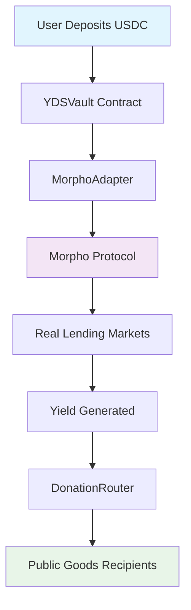
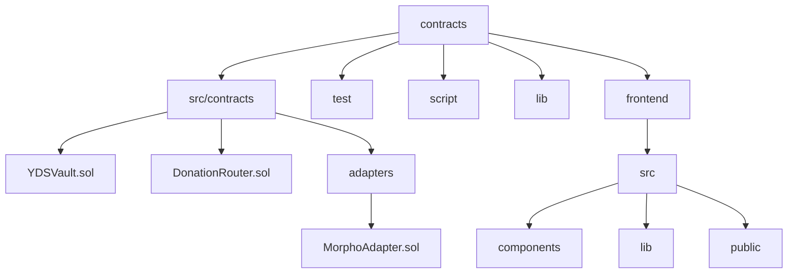

# 🌿 Octant V2 Tutorial - Yield Donating Strategy Vault

**Complete tutorial for building Octant V2 - Yield-Driven Staking for Public Goods with real Morpho integration**

## 🎯 Overview

This repository demonstrates how to build **Octant V2** - a revolutionary yield-driven staking protocol where:

- 💰 Users deposit **USDC** to earn yield through **real Morpho lending**
- 🌍 **100% of generated yield** is automatically donated to **public goods**
- 🔒 **User principal is always protected** and withdrawable anytime
- 📈 **~7% APY** from actual DeFi lending (not simulated!)

## ✨ Key Features

- 🏦 **Real Morpho Integration**: Uses actual Morpho protocol for yield generation
- 🎁 **Automated Donations**: All yield automatically flows to public goods
- 🛡️ **Principal Protection**: Users maintain full control of their deposits
- 🎨 **Beautiful UI**: Modern React frontend with Web3 integration
- 🧪 **Comprehensive Testing**: Full test suite with mainnet fork testing
- 📊 **Live Data**: Real-time contract statistics and yield tracking

## 🏗️ Architecture

## 📁 Repository Structure

| --------------- | ----------------------------- | ------------------------------------------ |
| Smart Contracts | Solidity + Foundry            | Core logic for vault, adapter, and router  |
| Frontend        | Next.js 16 + Tailwind + Wagmi | Connect wallet and interact with the vault |
| Blockchain      | Anvil (Local EVM)             | Local testing environment                  |
| Package Manager | pnpm / npm                    | Frontend dependency management             |

---

## 🧪 Common Commands

| Command                        | Description              |
| ------------------------------ | ------------------------ |
| `forge build`                  | Compile all contracts    |
| `forge test -vvv`              | Run full test suite      |
| `anvil`                        | Start local testnet      |
| `forge script ... --broadcast` | Deploy contracts         |
| `pnpm run dev`                 | Run the frontend locally |

---

## 📜 License

MIT © 2025 [Bimajadivaaa](https://github.com/Bimajadivaaa)

---

## 🌐 Links

* 📘 **Docs:** [https://docs.v2.octant.build](https://docs.v2.octant.build)
* 🎥 **Tutorial Video:** [Youtube](https://youtu.be/xkVgl2yoq-g)
* ✨ **Medium Blog:** [Medium](https://medium.com/@bimajdv7/how-i-built-a-self-perpetuating-donation-engine-that-never-touches-your-principal-834a86512ea8)

---

> This project is part of the **Octant V2 Hackathon**, demonstrating how on-chain yield can fund public goods transparently through a yield-donating vault.
